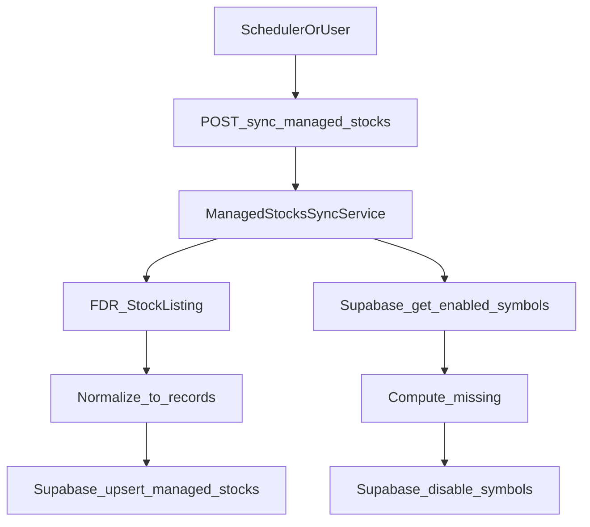

## 목표

- FDR `StockListing()`으로 선택한 시장(KRX, ETF/KR, S&P500, NASDAQ, NYSE, AMEX)의 종목 목록을 수집
- `managed_stocks`에 `{symbol, name, country, enabled}` 형태로 **대량 upsert**
- 이번 동기화 결과에 **없는 기존 종목은 enabled=false** 처리(국가별)
- 크론/수동 실행을 위해 **보호된 API 엔드포인트** 제공

## 현재 코드에서 재사용할 부분

- Supabase 접근 패턴: `app/repositories/supabase_client.py`에서 `.table(...).upsert(...).in_(...).eq(...)` 사용
- 에러 처리/Slack 알림: `app/utils/slack_notifier.py:send_slack_error_log`
- 인증: `app/api/dependencies.py:verify_auth` (기존 `/update-prices`와 동일하게 적용)

## 설계(시니어 관점 보완 포인트)

- **관심사 분리**: “외부 목록 수집(FDR)”과 “DB 동기화(Repo)”와 “오케스트레이션(Service)”를 분리
- **표준 레코드 정의**: 시장별로 컬럼명이 다를 수 있으니, `normalize_listing()`에서 `Symbol/Name` 후보를 흡수
- **대량 처리/안전성**: upsert/disable을 심볼 500~1000개 단위로 배치 처리
- **Idempotent**: 같은 시장으로 여러 번 실행해도 동일 결과
- **관측성**: 시장별 수집 건수/DB upsert 건수/disable 건수 로깅

## 추가/변경 파일

- `app/services/listings/fdr_listings.py` (신규)
  - `fetch_stock_listing(market: str) -> DataFrame`
  - `normalize_stock_listing(market: str, df) -> list[dict]`
  - `market_to_country(market) -> str` (KR/US)
- `app/services/managed_stocks_sync_service.py` (신규)
  - `sync_managed_stocks(markets: list[str]) -> dict`:
    - 시장별 listing 수집 → 통합/중복 제거
    - 국가별로 `upsert_managed_stocks(records)`
    - 국가별로 `disable_missing_managed_stocks(country, current_symbols)`
- `app/repositories/supabase_client.py` (추가)
  - `upsert_managed_stocks(records: list[dict]) -> tuple[int, list[str]]`
  - `get_enabled_managed_stock_symbols(country: str) -> set[str]`
  - `disable_managed_stocks(symbols: list[str], country: str) -> int` (배치 update)
- `app/api/routes.py` (추가)
  - `POST /sync-managed-stocks` 엔드포인트
  - request: `{ "markets": ["KRX", "NASDAQ", ...] }` (미지정 시 기본값=선택한 6개)
- `pyproject.toml` (추가 의존성)
  - `FinanceDataReader` (패키지명: `finance-datareader`)
  - `pandas` (listing 정규화에 사용)

## 데이터 흐름(요약)

## 핵심 구현 규칙

- **symbol 정규화**: `.strip().upper()`
- **country 매핑**:
  - KR: `KRX`, `ETF/KR`(ETFs는 KR로 고정)
  - US: `S&P500`, `NASDAQ`, `NYSE`, `AMEX`
- **disable_missing**: 국가별로 현재 enabled 심볼 집합에서 이번 동기화 결과를 뺀 나머지를 enabled=false로 일괄 update

## 검증(가볍게)

- 로컬에서 `/sync-managed-stocks` 호출 시 응답에 시장별/국가별 수집/업서트/비활성화 건수가 포함되는지 확인
- 기존 `/update-prices` 플로우에는 영향이 없는지 확인(기존 `get_managed_stocks`는 그대로 사용)
