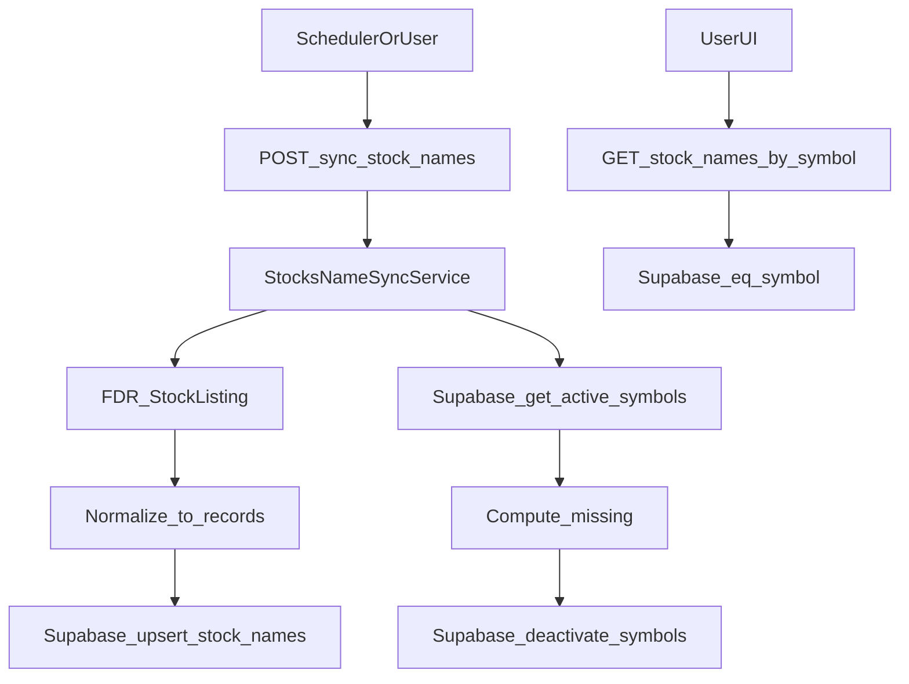

## 목표

- Supabase에 새 테이블 `stock_names` 생성 및 FDR 기반 동기화 파이프라인 구축
- 화면에서 ticker 입력 시 **전체 로드 없이** `stock_names`에서 **symbol 정확일치 1건 조회**
- 성능/부하 측면에서 불필요한 전체 fetch를 제거하고, DB는 point-lookup에 최적화

## 핵심 결론(부하 관점)

- 화면 요구사항이 **정확일치 1건 조회**라면, “전체 데이터를 가져오지 않기”가 가장 큰 최적화입니다.
- Postgres(Supabase)에서는 `symbol`에 `UNIQUE` 제약(=B-Tree 인덱스)만 있어도 조회는 O(log N)으로 매우 가볍습니다.
- 파티셔닝은 테이블이 매우 커지거나(수천만 단위) 관리/보관 정책이 복잡해질 때 고려하는 게 일반적이라, 이번 범위에서는 **기본은 인덱스 기반**, **파티셔닝은 옵션**으로 설계합니다.

## Supabase 테이블 설계(기본안)

- 테이블: `stock_names`
  - `id BIGSERIAL PRIMARY KEY`
  - `symbol VARCHAR(20) NOT NULL UNIQUE`
  - `name VARCHAR(255)`
  - `country VARCHAR(10)`
  - `source VARCHAR(50) NOT NULL DEFAULT 'FDR'`
  - `is_active BOOLEAN NOT NULL DEFAULT true`
  - `created_at TIMESTAMPTZ DEFAULT now()`
  - `updated_at TIMESTAMPTZ DEFAULT now()`
- 인덱스(추가): `(country)`, `(is_active)`

## 조회 API(전체 fetch 방지)

- `GET /stocks-name/{symbol}`
  - 입력 `symbol`을 `.strip().upper()`로 정규화
  - Supabase: `stock_names`에서 `eq('symbol', symbol)`로 1건 조회
  - 응답 예: `{ "symbol": "AAPL", "name": "Apple Inc.", "country": "US" }`
- 이 방식이면 프론트는 **단일 요청/단일 row**만 받아가서 부하 문제가 사실상 사라집니다.

## 파티셔닝(옵션, 필요 시 적용)

- 기본(권장): **파티셔닝 없이** `symbol UNIQUE` 인덱스로 운영
- 옵션(대용량 대비): **HASH 파티셔닝 by symbol**
  - 예: `PARTITION BY HASH (symbol)` 후 8~16개 파티션
  - point-lookup은 어차피 인덱스로 빠르지만, 매우 큰 규모에서 vacuum/관리 단위를 나누고 싶을 때 선택
- 이 옵션은 실제 데이터 규모/증가율을 본 뒤 적용하는 게 안전하므로, 이번 PR 범위에서는 `SUPABASE_SCHEMA.md`에 “선택적 DDL”로 같이 적어두는 방식으로 포함합니다.

## 코드 구조(프로젝트 패턴에 맞춤)

- 외부 수집: [`app/services/listings/fdr_listings.py`](/Users/leena/Desktop/dev/side-project/backend/wb-stock-price-updater/app/services/listings/fdr_listings.py)
  - `fetch_stock_listing(market: str)`
  - `normalize_stock_listing(market: str, df) -> list[dict]` (symbol/name/country/source/is_active)
- 파이프라인: [`app/services/stock_names_sync_service.py`](/Users/leena/Desktop/dev/side-project/backend/wb-stock-price-updater/app/services/stock_names_sync_service.py)
  - `sync_stock_names(markets: list[str]) -> dict`
  - 수집 결과에 없는 기존 active 종목은 `is_active=false`
- DB 접근: `app/repositories/supabase_client.py`
  - `upsert_stock_names(records)`
  - `get_active_stock_names_symbols(country)`
  - `deactivate_stock_names(symbols, country)`
  - `get_stock_name_by_symbol(symbol)` (조회 API용)
- API: `app/api/routes.py`
  - `POST /sync-stocks-name` (인증 필요)
  - `GET /stocks-name/{symbol}` (인증 여부는 선택: 내부용이면 인증 유지 권장)
- 의존성: `pyproject.toml`에 `finance-datareader`, `pandas` 추가

## 동기화 정책(이미 확정된 값 반영)

- 동기화 대상 시장: `KRX`, `ETF/KR`, `S&P500`, `NASDAQ`, `NYSE`, `AMEX`
- 신규/갱신: `is_active=true`
- 누락: `is_active=false`
- Unique: `symbol` 단일 unique
- 사용처: 가격 수집은 계속 `managed_stocks`, `stock_names`은 name/country 보강용

## 데이터 흐름

