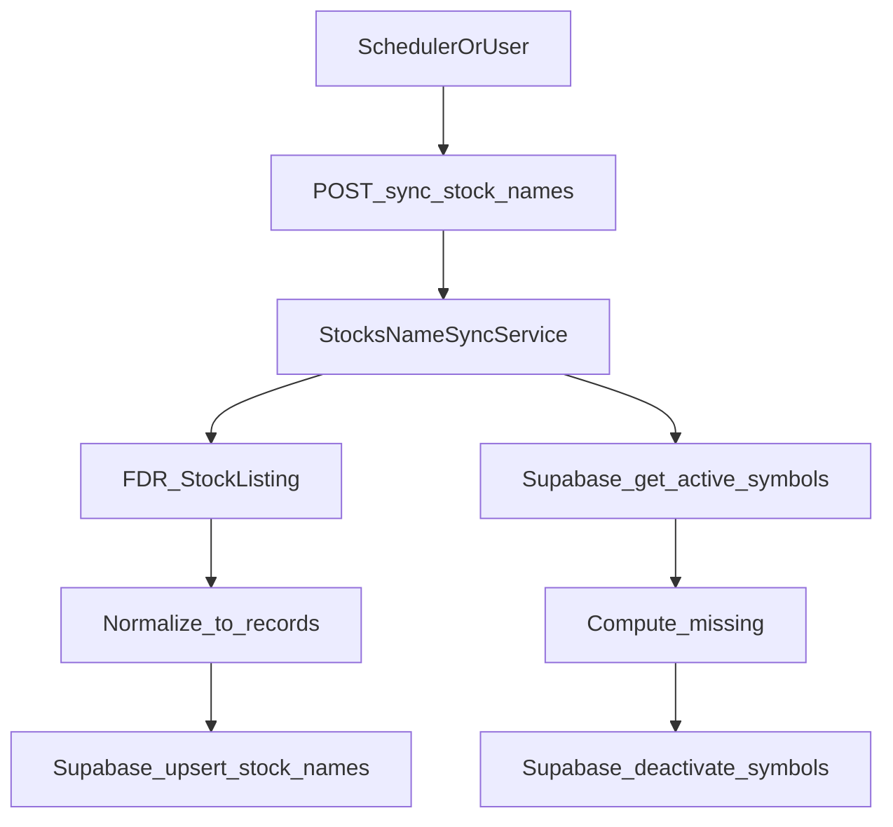

## 목표

- Supabase에 새 테이블 `stock_names` 생성
- FDR `StockListing()`으로 시장(KRX, ETF/KR, S&P500, NASDAQ, NYSE, AMEX) 종목 목록 수집
- `stock_names`에 `{symbol, name, country, source, is_active}` 형태로 **대량 upsert**
- 이번 동기화 결과에 없는 기존 row는 `is_active=false`로 비활성화
- 실행은 인증된 API 엔드포인트로 트리거

## Supabase 테이블 설계(제안)

- 테이블: `stock_names`
  - `id BIGSERIAL PRIMARY KEY`
  - `symbol VARCHAR(20) NOT NULL UNIQUE`
  - `name VARCHAR(255)`
  - `country VARCHAR(10)`
  - `source VARCHAR(50) NOT NULL DEFAULT 'FDR'`
  - `is_active BOOLEAN NOT NULL DEFAULT true`
  - `created_at TIMESTAMPTZ DEFAULT now()`
  - `updated_at TIMESTAMPTZ DEFAULT now()`
- 인덱스: `(country)`, `(is_active)`

## 코드 구조(프로젝트 패턴에 맞춤)

- 외부 수집: [`app/services/listings/fdr_listings.py`](/Users/leena/Desktop/dev/side-project/backend/wb-stock-price-updater/app/services/listings/fdr_listings.py)
  - `fetch_stock_listing(market: str)`
  - `normalize_stock_listing(market: str, df) -> list[dict]` (symbol/name/country/source/is_active)
- 파이프라인: [`app/services/stock_names_sync_service.py`](/Users/leena/Desktop/dev/side-project/backend/wb-stock-price-updater/app/services/stock_names_sync_service.py)
  - `sync_stock_names(markets: list[str]) -> dict`
  - 시장별 수집 → 통합/중복 제거 → repo upsert
  - 기존 `is_active=true` 심볼 중 이번 결과에 없는 심볼은 `is_active=false`
- DB 접근: `app/repositories/supabase_client.py`
  - `upsert_stock_names(records: list[dict])`
  - `get_active_stock_names_symbols(country: str) -> set[str]`
  - `deactivate_stock_names(symbols: list[str], country: str)`
- API: `app/api/routes.py`
  - `POST /sync-stocks-name` (기존 `verify_auth` 적용)
  - request: `{ "markets": ["KRX", "ETF/KR", "NASDAQ", ...] }` (미지정 시 기본값)

## 데이터 흐름

## 정책(사용자 선택 반영)

- 동기화 대상: `KRX`, `ETF/KR`, `S&P500`, `NASDAQ`, `NYSE`, `AMEX`
- 신규/갱신: `is_active=true`
- 누락: `is_active=false`
- Unique: `symbol` 단일 unique
- 사용처: 가격 수집은 계속 `managed_stocks`가 소스, `stock_names`은 보강용

## 변경 예정 파일

- `SUPABASE_SCHEMA.md`: `stock_names` 생성 SQL 및 컬럼 설명 추가
- `pyproject.toml`: `finance-datareader`, `pandas` 의존성 추가
- `app/repositories/supabase_client.py`: `stock_names` CRUD 추가
- `app/services/listings/fdr_listings.py`: FDR listing 수집/정규화
- `app/services/stock_names_sync_service.py`: 동기화 오케스트레이션
- `app/api/routes.py`: `/sync-stocks-name` 엔드포인트 추가
