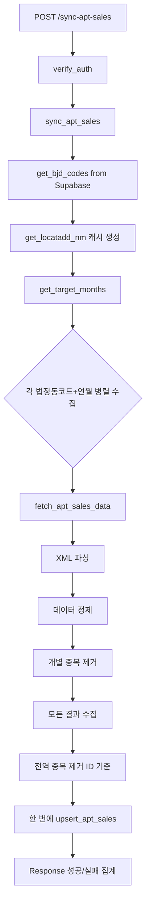

# 아파트 실거래가 수집 및 저장 API 구현

## 개요

공공데이터포털의 아파트 실거래가 API를 사용하여 데이터를 수집하고, Supabase의 `apt_sales` 테이블에 저장하는 기능을 구현합니다. 기존 프로젝트 구조와 동일한 패턴을 따릅니다.

## 구현 계획

### 1. 환경 설정 및 스키마 정의

**파일 수정**: [`app/config.py`](app/config.py)

- `data_go_api_key` 환경변수 추가

**Supabase 테이블 수정**: `bjd_code` 테이블에 `priority` 컬럼 추가

```sql
-- bjd_code 테이블에 priority 컬럼 추가
ALTER TABLE bjd_code ADD COLUMN priority INTEGER;

-- 인덱스 추가 (조회 성능 향상)
CREATE INDEX idx_bjd_code_priority ON bjd_code(priority) WHERE priority IS NOT NULL;

-- 우선순위 설정 예시
-- 1순위: 서울시 주요 구 (강남, 서초, 송파, 강동, 용산 등)
UPDATE bjd_code SET priority = 1 WHERE region_cd_5 IN ('11110', '11140', '11170', '11200', '11215', '11230', '11260', '11290', '11305', '11320');

-- 2순위: 서울시 나머지 구
UPDATE bjd_code SET priority = 2 WHERE region_cd_5 LIKE '11%' AND priority IS NULL;

-- 3순위: 경기도 주요 시 (수원, 성남, 고양, 용인 등)
UPDATE bjd_code SET priority = 3 WHERE region_cd_5 IN ('41110', '41130', '41150', '41170', '41190', '41210', '41280', '41290');

COMMENT ON COLUMN bjd_code.priority IS '수집 우선순위 (1=최우선, 2=중요, 3=일반, null=수집안함)';
```

**Supabase 테이블**: `apt_sales` 테이블 스키마

```sql
CREATE TABLE apt_sales (
    id VARCHAR(64) PRIMARY KEY,  -- MD5 해시
    apt_name VARCHAR(255) NOT NULL,
    area DECIMAL(10, 2),
    floor INTEGER,
    deal_amount BIGINT NOT NULL,
    deal_date DATE NOT NULL,
    deal_year VARCHAR(4),
    deal_month VARCHAR(2),
    deal_day VARCHAR(2),
    lawd_code VARCHAR(5),
    created_at TIMESTAMPTZ DEFAULT NOW(),
    updated_at TIMESTAMPTZ DEFAULT NOW()
);
```

### 2. 서비스 레이어 구현

**새 파일**: `app/services/apt_sales_service.py`

- `fetch_apt_sales_data()`: 공공데이터 API 호출 및 XML 파싱
- `sync_apt_sales()`: 메인 비즈니스 로직 (법정동코드 조회 → API 호출 → 저장)
- `get_target_months()`: 이번 달과 지난달 연월(YYYYMM) 생성
- `generate_apt_id()`: MD5 해시 기반 고유 ID 생성 (아파트명+금액+면적+층+거래일)

**참고 패턴**: [`app/services/exchange_rates_service.py`](app/services/exchange_rates_service.py)의 구조 참고

### 3. Repository 레이어 확장

**파일 수정**: [`app/repositories/supabase_client.py`](app/repositories/supabase_client.py)

- `get_bjd_codes()`: `bjd_code` 테이블에서 `region_cd_5` 조회 (**priority 필터링 추가**)
  ```python
  async def get_bjd_codes(
      lawd_codes: Optional[List[str]] = None,
      priority: Optional[int] = 1  # 기본값: 1순위만
  ) -> List[str]:
      """
      bjd_code 테이블에서 법정동코드 목록을 조회합니다.

      Args:
          lawd_codes: 특정 법정동코드 리스트 (우선 사용)
          priority: 우선순위 필터 (1, 2, 3 또는 None)

      Returns:
          List[str]: 법정동코드 리스트
      """
      if lawd_codes:
          # 명시적으로 지정된 경우 우선 사용
          return lawd_codes

      query = supabase.table("bjd_code").select("region_cd_5")

      if priority is not None:
          query = query.eq("priority", priority)

      response = query.execute()
      return [row["region_cd_5"] for row in response.data]
  ```
- `upsert_apt_sales()`: `apt_sales` 테이블에 데이터 upsert (on_conflict: id)

**참고 패턴**: 기존 `upsert_exchange_rates()` 함수와 동일한 에러 처리 패턴 사용

### 4. API 엔드포인트 구현

**파일 수정**: [`app/api/routes.py`](app/api/routes.py)

**새 엔드포인트**: `POST /sync-apt-sales`

- Request Body: `{ "lawd_codes": ["11110", "11140"], "deal_ym": "202501", "priority": 1 }` (optional)
  - `lawd_codes`: 특정 법정동코드 지정 (이 값이 있으면 최우선 사용)
  - `deal_ym`: 거래연월 지정 (없으면 이번 달 + 지난달)
  - `priority`: 우선순위 필터 (없으면 기본값 1, 즉 1순위만 수집)
- 인증: `verify_auth` dependency 사용 (CRON_SECRET)
- Response: 수집된 데이터 건수, 성공/실패 건수, 에러 목록

**요청 예시**:
```bash
# 1순위 지역만 수집 (기본값)
curl -X POST "/sync-apt-sales" -d '{}'

# 1, 2순위 모두 수집
curl -X POST "/sync-apt-sales" -d '{"priority": 2}'

# 특정 법정동코드만 수집 (priority 무시됨)
curl -X POST "/sync-apt-sales" -d '{"lawd_codes": ["11110"]}'
```

**참고 패턴**: 기존 `/sync-exchange-rates` 엔드포인트와 동일한 구조

### 5. 에러 처리 및 로깅

- XML 파싱 에러 처리 (잘못된 응답, 빈 데이터)
- API 호출 실패 시 재시도 로직 (기존 rate_limiter 활용 가능)
- Slack 알림 통합 (`slack_notifier.py` 사용)
- 각 법정동코드별 독립적 에러 격리 (일부 실패해도 전체 중단 안 됨)

## 데이터 흐름



## 핵심 구현 사항

1. **XML 파싱**: `xml.etree.ElementTree` 사용하여 공공데이터 응답 처리

2. **API 호출 최적화**:
   - ⚠️ **중요**: `numOfRows=999` 파라미터 추가 (기본값 10개로는 데이터 누락 발생)
   - URL 예시: `...&LAWD_CD={code}&DEAL_YMD={ym}&numOfRows=999`
   - 한 달에 거래가 10개 이상인 경우 데이터가 잘림 방지

3. **데이터 정제 순서 (중요)**:
   ```python
   # 1단계: 원본 데이터 추출
   deal_amount_str = item.findtext('dealAmount')  # "  50,000  "
   apt_name_str = item.findtext('aptNm')           # "  래미안  "

   # 2단계: 정제 (trim + 콤마 제거)
   deal_amount = int(deal_amount_str.strip().replace(',', ''))  # 50000
   apt_name = apt_name_str.strip()                               # "래미안"

   # 3단계: 정제된 데이터로 ID 생성 (순서 중요!)
   apt_id = generate_apt_id(apt_name, deal_amount, ...)
   ```
   - ⚠️ **주의**: ID 생성 전에 반드시 정제 완료해야 함
   - 정제 전: " 120,000 " vs 정제 후: "120000" → 다른 ID 생성됨

4. **날짜 형식 변환**:
   ```python
   # API 응답: 연/월/일 분리
   year = item.findtext('dealYear').strip()      # "2025"
   month = item.findtext('dealMonth').strip().zfill(2)  # "1" -> "01"
   day = item.findtext('dealDay').strip().zfill(2)      # "5" -> "05"

   # DB용 DATE 형식으로 조합
   deal_date = f"{year}-{month}-{day}"  # "2025-01-05"
   ```
   - `zfill(2)`: "1" → "01", "5" → "05" (0 패딩)
   - DB의 DATE 타입과 일치하는 YYYY-MM-DD 형식

5. **법정동코드 우선순위 관리**:
   - ✅ **선택된 방식**: `priority` 컬럼 추가 (1=최우선, 2=중요, 3=일반, null=수집안함)
   - 🎯 **기본 동작**: `lawd_codes` 미지정 시 **priority=1 지역만 자동 수집** (안전)
   - 📊 **우선순위 정책**:
     ```
     Priority 1 (최우선): 서울시 주요 구 10개
       - 강남(11230), 서초(11260), 송파(11260), 강동(11250)
       - 마포(11290), 용산(11170), 종로(11110), 중구(11140)
       - 영등포(11230), 강서(11200)

     Priority 2 (중요): 서울시 나머지 구 (15개)

     Priority 3 (일반): 경기도 주요 시
       - 수원(41110), 성남(41130), 고양(41150), 용인(41170)

     Priority null: 수집 제외
     ```
   - 🔧 **유연한 확장**: 요청 시 `priority` 파라미터로 범위 확대 가능
     - `priority=1`: 1순위만 (기본값, 약 20회 API 호출/월)
     - `priority=2`: 1~2순위 (약 50회 API 호출/월)
     - `priority=3`: 1~3순위 (약 100회 API 호출/월)

6. **고유 ID 생성**: `{apt_name}_{deal_amount}_{area}_{floor}_{deal_date}` 문자열을 MD5 해시

7. **Upsert 로직**: 동일 ID는 업데이트 (중복 방지)

8. **증분 수집**: 이번 달과 지난달만 수집하여 누락 방지

## 테스트 시나리오

1. ~~전체 법정동코드로 자동 수집~~ (권장하지 않음 - API 할당량 소진)
2. **서울시 주요 구 수집** (`{"lawd_codes": ["11110", "11140", "11170"]}`) - 권장
3. 특정 연월 지정 (`{"deal_ym": "202412"}`)
4. API 인증 실패 시나리오
5. 잘못된 법정동코드 처리
6. **numOfRows 파라미터 없이 호출** (데이터 누락 확인)
7. **데이터 정제 전후 ID 일치 테스트**

## 주요 개선 사항 체크리스트

- [ ] API URL에 `numOfRows=999` 파라미터 추가됨
- [ ] 데이터 정제(trim, 콤마 제거) 후 ID 생성하도록 순서 확정
- [ ] 날짜 필드 zfill(2) 처리하여 "01", "05" 형식 보장
- [ ] **bjd_code 테이블에 priority 컬럼 추가 및 데이터 설정**
- [ ] **get_bjd_codes() 함수에 priority 파라미터 추가 (기본값=1)**
- [ ] **sync_apt_sales() 함수에서 priority 기반 조회 구현**
- [ ] **API 엔드포인트에 priority 파라미터 추가**
- [ ] 법정동코드 기본값을 priority=1로 제한 (전국 수집 방지)

## API 할당량 관리

**공공데이터포털 API 제약**:
- 일일 호출 제한: 보통 1,000~10,000건 (인증키마다 다름)
- 초당 호출 제한: 보통 1~10건

**수집 전략**:
```
서울시 25개 구 × 2개월 = 50회 API 호출
전국 250개 시군구 × 2개월 = 500회 API 호출 (주의 필요)
전국 3,500개 법정동 × 2개월 = 7,000회 API 호출 (할당량 초과 위험)
```

**권장 수집 범위**:
1. **1단계 (안전)**: 서울시 주요 구 10개 (20회/월)
2. **2단계 (적정)**: 서울시 전체 25개 (50회/월)
3. **3단계 (주의)**: 수도권 50개 시군구 (100회/월)
4. **4단계 (위험)**: 전국 250개 시군구 (500회/월)
