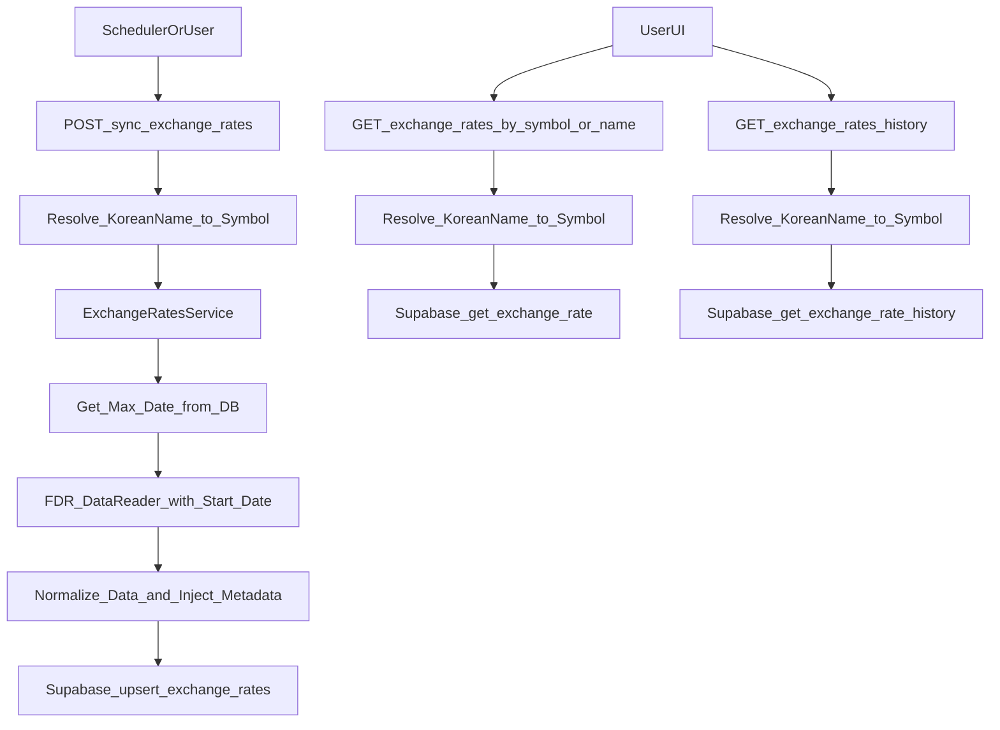

## 목표

- FDR `DataReader()`로 환율/인덱스 시계열 데이터 수집
- 새 테이블 `exchange_rates`에 날짜별 데이터 저장 (Close와 Adj Close 둘 다)
- 조회용 API 엔드포인트 제공
- 한국어 이름으로 심볼 조회 지원 (예: "원달러환율" → "USD/KRW", "달러인덱스" → "^NYICDX")
- **최적화된 증분 수집**: MAX(date) 기반으로 최신 날짜 이후 데이터만 수집

## Supabase 테이블 설계

- 테이블: `exchange_rates`
  - `id BIGSERIAL PRIMARY KEY`
  - `symbol VARCHAR(50) NOT NULL` (예: "USD/KRW", "^NYICDX", "BTC/KRW", "BTC/USD")
  - `date DATE NOT NULL`
  - `close_price DECIMAL(20, 8) NOT NULL` (Close 가격)
  - `adj_close_price DECIMAL(20, 8)` (Adj Close 가격, nullable)
  - `currency VARCHAR(10)` (기준 통화, 예: "USD", "KRW")
  - `name VARCHAR(255)` (예: "원달러환율", "달러인덱스")
  - `created_at TIMESTAMPTZ DEFAULT NOW()`
  - `updated_at TIMESTAMPTZ DEFAULT NOW()`
  - `UNIQUE(symbol, date)`
- 인덱스: `(symbol, date)`, `(date)`

## 코드 구조

- 수집 서비스: `app/services/exchange_rates_service.py` (신규)
  - `SYMBOL_NAME_MAP: dict[str, str]` - 한국어 이름 → 심볼 매핑
    - `{"원달러환율": "USD/KRW", "달러인덱스": "^NYICDX", "비트코인(원)": "BTC/KRW", "비트코인(달러)": "BTC/USD"}`
  - `SYMBOL_META: dict[str, dict]` - 심볼별 메타데이터 (name, currency)
    - `{"USD/KRW": {"name": "원달러환율", "currency": "KRW"}, "^NYICDX": {"name": "달러인덱스", "currency": "USD"}, ...}`
  - `resolve_symbol(name_or_symbol: str) -> str` - 한국어 이름 또는 심볼을 심볼로 변환
  - `fetch_exchange_rate_data(symbol: str, start_date: Optional[str] = None) -> pd.DataFrame`
  - `normalize_exchange_rate_data(symbol: str, df: pd.DataFrame) -> list[dict]` (Close, Adj Close, 메타데이터 포함)
  - `sync_exchange_rates(symbols: list[str]) -> dict` (한국어 이름도 지원, 최적화된 증분 수집)
- DB 접근: `app/repositories/supabase_client.py` (추가)
  - `get_max_date(symbol: str) -> Optional[str]` - 해당 심볼의 가장 최근 저장된 날짜 조회 (MAX(date))
  - `upsert_exchange_rates(records: list[dict])` - DB upsert에 위임 (Python 필터링 없음)
  - `get_exchange_rate(symbol: str, date: Optional[str] = None)`
  - `get_exchange_rate_history(symbol: str, start_date: str, end_date: str)`
- API: `app/api/routes.py` (추가)
  - `POST /sync-exchange-rates` (인증 필요, symbols 파라미터에 한국어 이름 또는 심볼 지원)
  - `GET /exchange-rates/{symbol_or_name}` (최신 값 조회, 한국어 이름 또는 심볼로 조회 가능)
  - `GET /exchange-rates/{symbol_or_name}/history` (시계열 조회, query params: start_date, end_date)

## 데이터 흐름

## 구현 세부사항

- 기본 심볼: `["^NYICDX", "USD/KRW", "BTC/KRW", "BTC/USD"]`
- 한국어 이름 매핑:
  - `"원달러환율"` → `"USD/KRW"`
  - `"달러인덱스"` → `"^NYICDX"`
  - `"비트코인(원)"` → `"BTC/KRW"`
  - `"비트코인(달러)"` → `"BTC/USD"`
- 심볼 메타데이터:
  - `SYMBOL_META` 딕셔너리에서 `name`, `currency` 정보를 가져와 정규화 시 DB에 저장
- 심볼 해석 로직: `resolve_symbol()` 함수에서 먼저 매핑 딕셔너리 확인, 없으면 입력값을 그대로 심볼로 사용
- FDR `DataReader()`는 시계열 DataFrame 반환 (Date, Open, High, Low, Close, Adj Close, Volume)
- **Close와 Adj Close 둘 다 수집**: DataFrame에서 `Close`와 `Adj Close` 컬럼 모두 추출하여 저장
  - 참고: 환율/암호화폐는 배당/분할이 없어 대부분 Close와 Adj Close가 동일하지만, 시스템 일관성을 위해 둘 다 저장
- 정규화 로직: 각 행에서 `Close`와 `Adj Close` 값을 모두 가져와서 레코드에 포함, `SYMBOL_META`에서 메타데이터 주입
- Rate limiting: 기존 `request_queue` 재사용 (비동기 처리)
- 에러 처리: 심볼별 `try-except`로 실패 격리 (기존 패턴과 동일, Slack 알림)

## 동기화 정책 (최적화된 증분 수집)

- **MAX(date) 기반 증분 수집**: 전체 날짜 집합 조회 대신 가장 최근 날짜 하나만 조회
- 프로세스:

  1. 각 심볼별로 DB에서 가장 최근 저장된 날짜(`last_date`) 조회 (`get_max_date(symbol)`)
  2. `last_date`가 있으면 `fdr.DataReader(symbol, start=last_date)`로 **그 날짜 이후의 데이터만** 요청
  3. `last_date`가 없으면 (첫 수집) 전체 기간 요청 또는 최근 1년 등 기본값 사용
  4. FDR에서 받아온 데이터를 **Python 레벨 필터링 없이** 바로 `upsert_exchange_rates`에 전달
  5. DB의 `UNIQUE(symbol, date)` 제약과 `upsert` 기능이 자동으로 **새 날짜는 Insert, 기존 날짜는 Update** 처리

- **장점**: 네트워크 트래픽 감소, 메모리 절약, 로직 단순화, Python 레벨 날짜 집합 연산 불필요
- **주의**: `last_date`를 포함해서 요청하는 이유는, 장 중이라 값이 변했거나 `Adj Close`가 보정되었을 수 있기 때문에 **마지막 날짜는 덮어쓰기(Update)** 하는 것이 안전
- 첫 수집: 모든 날짜 삽입 (또는 최근 1년 등 기본값)
- 이후 수집: `last_date` 이후 데이터만 수집 (성능 최적화)
- Upsert: `(symbol, date)` unique 기준으로 DB가 자동 처리
- 배치 처리: 여러 심볼을 병렬로 수집
- 한국어 이름 지원: sync API와 조회 API 모두에서 한국어 이름 입력 시 자동으로 심볼로 변환

## 엣지 케이스 처리

- **장중 데이터 처리**: 비트코인은 24시간 거래, 환율도 실시간 변동. 오늘 날짜 데이터는 수집 시점의 현재가이므로 계속 갱신될 수 있음. Upsert 방식으로 오늘 날짜 데이터가 계속 업데이트되도록 처리
- **FDR 실패 대응**: 특정 심볼 수집 실패가 전체 프로세스를 중단시키지 않도록, 심볼별 `try-except` 처리로 실패 격리
- **메타데이터 부재**: FDR 데이터 자체에는 `currency`, `name` 정보가 명시적으로 포함되지 않을 수 있으므로, `SYMBOL_META` 딕셔너리에서 가져와 주입
